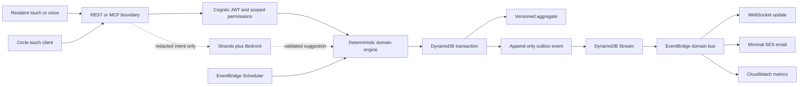

# Architecture

## Safety plane and convenience plane

STAY deliberately separates deterministic coordination from generative interpretation.

Bedrock cannot select escalation order, mutate policy, reveal protected data, assign responders, or resolve incidents. If it fails, every solid-line path remains available.

The MCP HTTP transport is stateless, but product state is not Lambda-memory state. Each AWS tool call loads the authorized household’s current aggregates from DynamoDB and persists commands through the shared transaction repository. The household-scoped in-memory engine exists only when `TABLE_NAME` is absent for local protocol tests.

The optional simulator intent route invokes the Strands/Nova interpreter with only the typed utterance, current surface, locale, and visible synthetic entity IDs. It returns a validated interpretation and never executes a tool. Explicit emergency wording is intercepted by a deterministic domain guard before any model call, so the supplementary-service boundary remains available even when Bedrock is off. Missing model configuration or a Bedrock failure returns an explicit provider-unavailable response for non-critical interpretation while deterministic state machines and controls continue to operate.

## DynamoDB item families

The table uses `PK = HOUSEHOLD#{householdId}` and typed sort keys. Incidents are independent aggregates, not nested household blobs.

| Sort key                                            | Purpose                                      |
| --------------------------------------------------- | -------------------------------------------- |
| `HOUSEHOLD#...`, `RESIDENT#...`                     | Household and resident profile               |
| `CIRCLE#...`, `ACCESS#...`, `HOUSE-MEMORY#...`      | Membership, adaptive access, House Memory    |
| `TASK#...`, `SAFETY-WINDOW#...`, `HELP-REQUEST#...` | Versioned product workflows                  |
| `PLAYBOOK#...`, `PRIVACY#...`                       | Versioned plan and privacy workflows         |
| `INCIDENT#...`                                      | Independent incident metadata and assignment |
| `INCIDENT#...#EVENT#...`                            | Append-only incident timeline                |
| `OUTBOX#{time}#{eventId}`                           | Transactional domain event                   |
| `IDEMPOTENCY#{key}`                                 | TTL duplicate-suppression record             |
| `CONFIRMATION#{tokenHash}`                          | TTL-scoped sensitive-action approval         |
| `CONNECTION#{id}`, `DEMO#{id}`                      | TTL WebSocket and isolated demo records      |

The write transaction requires the current version, writes version `n + 1`, appends the outbox event, and reserves the idempotency key. Sensitive privacy changes also consume an actor-, entity-, purpose-, and version-scoped confirmation token in that same transaction. Raw confirmation tokens are never stored. Stale or duplicate Scheduler events become observable no-ops.

## AWS topology

Cognito uses a version 2 pre-token-generation Lambda to copy the immutable household and resident attributes into the signed access token. Both REST and MCP require those claims for authenticated traffic and fail closed when either claim is absent; demo traffic remains isolated by its separately validated TTL session.

- The current public demo uses API Gateway plus a Lambda reader over a private KMS-encrypted S3 bucket because CloudFront creation is account-provider blocked. The separately gated CloudFront topology keeps private S3 as the default origin and forwards uncached `v1/*`, `mcp`, and `.well-known/*` behavior to API Gateway, preserving every public contract when the account gate is eventually cleared.
- API Gateway HTTP API serves REST, MCP, OAuth metadata, and the public TTL-isolated demo API.
- Cognito uses authorization code flow, a public no-secret PWA client, a confidential Alexa client, token revocation, refresh rotation, and no identity pool.
- DynamoDB uses on-demand capacity, KMS, PITR, TTL, Streams, and deletion protection.
- EventBridge Scheduler invokes one deterministic Safety Window transition Lambda through a dedicated role. Creation prepares named one-time open, first-check, and grace-expiry schedules with strict expected versions; stale, duplicate, cancelled, or resident-completed work becomes a logged no-op.
- A domain bus fans out to SQS-backed notification, WebSocket, and metric consumers with DLQs.
- SES sends minimal messages as `STAY <updates@saystay.site>`. The domain uses Easy DKIM 2048, a custom `mail.saystay.site` MAIL FROM domain with SPF, and DMARC. SES accepted the live sender test; inbox confirmation remains a separate check, and the account remains sandbox-limited. Sensitive detail stays inside an authenticated, active, assigned incident.
- Lambda uses Node 22, ARM64, X-Ray, bounded timeouts, structured logs, and adaptive AWS SDK retry.
- CloudWatch alarms and a `$25` monthly alert-only budget surface failures and cost; they do not automatically stop resources.

## Reconnect model

WebSocket messages are hints, not authority. On connection, reconnection, version gaps, or any delivery ambiguity, the client performs REST reconciliation against the latest aggregate version. This keeps disconnects and duplicate messages coherent.

## Public demo isolation

`POST /v1/demo-sessions` creates a four-hour TTL scope with a distinct demo household namespace. Routes below `/v1/demo/*` accept the opaque session in `X-STAY-Demo-Session`, verify its unexpired DynamoDB record, and can read or mutate only that synthetic namespace. WebSocket connection requests perform the same record check. Authenticated routes derive the household from Cognito claims and never accept a household identifier from request input.
