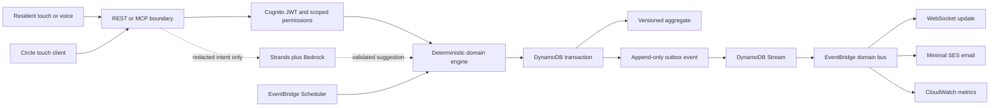

# Architecture

## Safety plane and convenience plane

STAY deliberately separates deterministic coordination from generative interpretation.

Bedrock cannot select escalation order, mutate policy, reveal protected data, assign responders, or resolve incidents. If it fails, every solid-line path remains available.

## DynamoDB item families

The table uses `PK = HOUSEHOLD#{householdId}` and typed sort keys. Incidents are independent aggregates, not nested household blobs.

| Sort key                                             | Purpose                                      |
| ---------------------------------------------------- | -------------------------------------------- |
| `HOUSEHOLD#...`, `RESIDENT#...`                      | Household and resident profile               |
| `CIRCLE#...`, `ACCESS#...`, `MEMORY#...`             | Membership, adaptive access, House Memory    |
| `TASK#...`, `WINDOW#...`, `HELP#...`, `PLAYBOOK#...` | Versioned product workflows                  |
| `INCIDENT#...`                                       | Independent incident metadata and assignment |
| `INCIDENT#...#EVENT#...`                             | Append-only incident timeline                |
| `OUTBOX#{time}#{eventId}`                            | Transactional domain event                   |
| `IDEMPOTENCY#{key}`                                  | TTL duplicate-suppression record             |
| `CONNECTION#{id}`, `DEMO#{id}`                       | TTL WebSocket and isolated demo records      |

The write transaction requires the current version, writes version `n + 1`, appends the outbox event, and reserves the idempotency key. Stale or duplicate Scheduler events become observable no-ops.

## AWS topology

- CloudFront uses a private, encrypted S3 origin and security headers.
- API Gateway HTTP API serves REST, MCP, OAuth metadata, and the public TTL-isolated demo API.
- Cognito uses authorization code flow, a public no-secret PWA client, a confidential Alexa client, token revocation, refresh rotation, and no identity pool.
- DynamoDB uses on-demand capacity, KMS, PITR, TTL, Streams, and deletion protection.
- EventBridge Scheduler invokes one deterministic Safety Window transition Lambda through a dedicated role.
- A domain bus fans out to SQS-backed notification, WebSocket, and metric consumers with DLQs.
- SES sends minimal messages. Sensitive detail stays inside an authenticated, active, assigned incident.
- Lambda uses Node 22, ARM64, X-Ray, bounded timeouts, structured logs, and adaptive AWS SDK retry.
- CloudWatch alarms and a `$25` monthly alert-only budget surface failures and cost; they do not automatically stop resources.

## Reconnect model

WebSocket messages are hints, not authority. On connection, reconnection, version gaps, or any delivery ambiguity, the client performs REST reconciliation against the latest aggregate version. This keeps disconnects and duplicate messages coherent.

## Public demo isolation

`POST /v1/demo-sessions` creates a four-hour TTL scope with a distinct demo household namespace. Routes below `/v1/demo/{sessionId}` are also unauthenticated, but can read or mutate only that synthetic namespace after validating the session identifier. Authenticated routes derive the household from Cognito claims and never accept a household identifier from request input.
